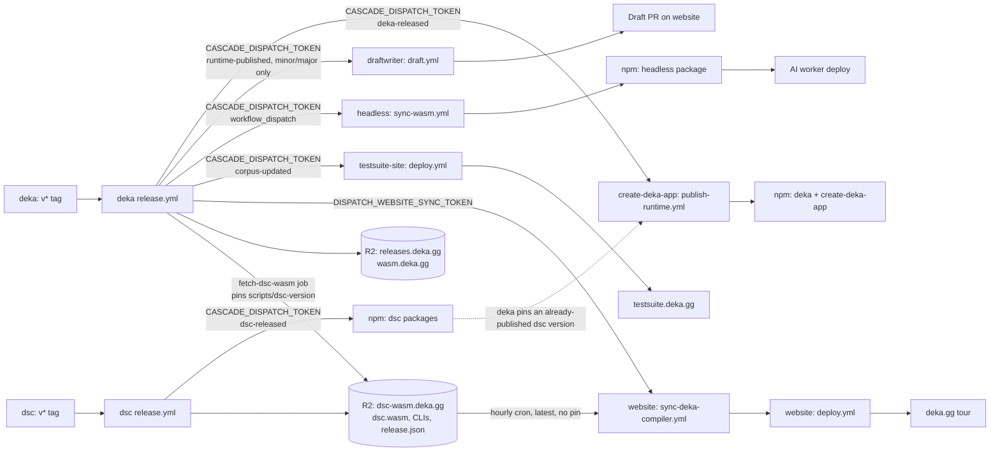

# Publishing the Deka runtime

This document describes how a new runtime release is produced, where the
artifacts land, and how downstream sites pick them up automatically.

## Overview

A release is driven entirely by GitHub Actions. Pushing an annotated tag matching
`v*` to `dekaruntime/deka` triggers `.github/workflows/release.yml`, which:

1. Runs the Rust test suite on linux-x64, darwin-x64, and darwin-arm64.
2. Builds the browser compiler + diagnostics WASM artifacts.
3. Builds native CLI binaries for linux-x64, darwin-x64, and darwin-arm64.
4. Publishes versioned artifacts to Cloudflare R2.
5. Promotes the `latest` pointers on R2.
6. Dispatches downstream workflows so the tour and conformance sites rebuild.
7. Dispatches the npm publish (see npm packages below).

All jobs run on self-hosted runners and use a shared sccache backend on R2.

## Cutting a release

1. Bump the lockstep version and refresh `Cargo.lock`:
   ```bash
   ./scripts/bump-version.sh patch    # or minor, or an explicit X.Y.Z
   ```
2. Open a PR with the bump, merge it to `main`.
3. Create and push an annotated tag from `main`:
   ```bash
   git checkout main
   git pull origin main
   scripts/runtime-version.sh          # must match the version you are tagging
   git tag -a "v$(scripts/runtime-version.sh)" -m "deka v$(scripts/runtime-version.sh)"
   git push origin "v$(scripts/runtime-version.sh)"
   ```
4. Watch the run:
   ```bash
   gh run list --repo dekaruntime/deka --workflow=release.yml
   gh run watch <RUN_ID> --repo dekaruntime/deka --exit-status
   ```

## Release artifacts

After a successful run the following are available on R2:

| Artifact | URL pattern | Consumers |
|---|---|---|
| Release manifest | `https://releases.deka.gg/latest.json` | CLI installers, testsuite native isolate runs |
| Versioned release | `https://releases.deka.gg/<VERSION>/...` | Native CLI binaries, WASM files |
| Compiler manifest | `https://wasm.deka.gg/latest/deka-compiler-artifact.json` | Website, testsuite |
| Diagnostics manifest | `https://wasm.deka.gg/latest/deka-diagnostics-artifact.json` | Website, testsuite |
| Compiler WASM | `https://wasm.deka.gg/latest/deka_compiler.wasm` | Website tour, testsuite |
| Diagnostics WASM | `https://wasm.deka.gg/latest/deka_diagnostics.wasm` | Website tour |

The `latest/*` paths are updated atomically at the end of the `publish` job.

## Downstream deployments

The release workflow does not deploy anything directly. Its `notify` job
(`needs: [publish]`, so nothing fires until the whole release is green) sends
five dispatches to other repositories. Each is independent — a failure in one
does not undo the release, but (see below) it can skip the ones that come
after it in the same job.



### Website (`dekaruntime/website`) — the tour

Triggered by:
- `workflow_dispatch` on `.github/workflows/sync-deka-compiler.yml`, sent by
  `notify` using `DISPATCH_WEBSITE_SYNC_TOKEN`.
- Independently, an hourly cron (`17 * * * *`) inside that same workflow.

What it does: `scripts/sync-deka-wasm-from-r2.ts` fetches
`https://dsc-wasm.deka.gg/latest/release.json` and the `dsc.wasm` /
`dsc_diagnostics.wasm` binaries **directly from dsc's own release bucket, not
from deka's `wasm.deka.gg` re-publish**. It commits them under `public/tour/`
only if the version or sha256 changed, then dispatches `deploy.yml` (pushed
with `GITHUB_TOKEN`, which cannot trigger a push-based deploy on its own, so
the sync workflow explicitly queues one).

Verified against the workflow, correcting an assumption in an earlier version
of this doc: **a dsc release updates the tour on its own**, via that hourly
cron, whether or not deka ever releases. A deka release's dispatch just makes
the sync happen sooner. deka's own `fetch-dsc-wasm` job — which downloads the
same dsc wasm at the version pinned in `scripts/dsc-version` and republishes
it to `wasm.deka.gg` for the testsuite/CLI-facing manifest — is a **separate
path that does not feed the tour**. The tour can therefore briefly be ahead of
what `wasm.deka.gg` (and deka's own pin) report, if dsc ships a version deka
has not picked up yet.

Silent on a missing token: if `DISPATCH_WEBSITE_SYNC_TOKEN` is unset, the
dispatch step logs and exits 0; the hourly cron is the safety net.

### Test suite (`dekaruntime/testsuite-site`)

Triggered by: `repository_dispatch` (`corpus-updated`) sent by `notify` using
`CASCADE_DISPATCH_TOKEN`, with `client_payload.corpus_sha` — the commit in
`dekaruntime/testsuite` that `scripts/testsuite-corpus-version` currently
pins. (This is `dekaruntime/testsuite-site`, not `dekaruntime/testsuite`:
`testsuite` is where the corpus/fixtures live, `testsuite-site` is what
deploys `testsuite.deka.gg`. An earlier version of this doc pointed the
manual fallback at `dekaruntime/testsuite`; that repo's own workflow is not
what this pipeline dispatches.)

Workflow: `.github/workflows/deploy.yml`

What it does:
- On the dispatch, fetches the corpus at the dispatched commit
  (`bun run fetch:corpus -- --ref <sha>`), ingests it, and runs every public
  fixture on **two Deka hosts**: the native isolate (`deka run`) and a
  Chromium Worker (WASM compile + tour sandbox). Node is not an execution
  host. See [RFD 26](https://github.com/dekaruntime/rfd/issues/26).
- Builds a static Next.js export and deploys it to Cloudflare Workers via
  Wrangler (`CLOUDFLARE_API_TOKEN` / `CLOUDFLARE_ACCOUNT_ID`, both required or
  the deploy step fails loudly).

The published site (`testsuite.deka.gg`) is a diagnostic grid. Pink cells are
host disagreement. Dump/CI exit 0 means the dump ran; it does not mean every
cell is green.

To dump an unreleased runtime against itself:

```bash
DEKA_NATIVE=./target/release/cli \
DEKA_WASM=./target/wasm32-unknown-unknown/release/deka_compiler_wasm.wasm \
  bun scripts/dump-results.mjs
```

(from a `dekaruntime/testsuite-site` checkout — `dump-results.mjs` lives
there, not in `dekaruntime/testsuite`)

Loud on a missing token: unlike every other dispatch in `notify`, this step
has no fallback branch — a missing or under-scoped `CASCADE_DISPATCH_TOKEN`
makes it print `::error::` and `exit 1`, failing the `notify` job. Because the
job's later steps are each gated on `if: success()`, **a failed testsuite-site
dispatch also skips the release-note draft and headless dispatches below it
in that same run** — both of those still catch up on their own hourly
polling, so nothing is lost, just delayed.

### Headless (`dekaruntime/headless`)

Triggered by: `workflow_dispatch` on `.github/workflows/sync-wasm.yml`, sent
by `notify` using `CASCADE_DISPATCH_TOKEN` — note this calls the
`actions/workflows/.../dispatches` endpoint with just `ref: main`, not the
`repository_dispatch` (`runtime-released`) that workflow's own header comment
describes; that trigger currently has no sender. Falls back to headless's own
hourly cron (`17 * * * *`), which resolves "latest" from
`https://releases.deka.gg/latest.json` when no version is pinned.

What it does: pins deka's compiler wasm, runs headless's tests against it,
bumps and tags headless's own package version, and pushes — which fires
headless's `publish.yml` to publish an npm package carrying that deka
version, then deploys the AI worker. The workflow polls `gh run list` to
confirm `publish.yml` actually started and fails loudly if it did not.

Silent on a missing token: the dispatch step in `notify` exits 0 if
`CASCADE_DISPATCH_TOKEN` is unset; the hourly cron recovers within the hour.

### Release notes (`dekaruntime/draftwriter`)

Triggered by: `repository_dispatch` (`runtime-published`) sent by `notify`
using `CASCADE_DISPATCH_TOKEN`, minor/major releases only — a patch tag exits
the step immediately, since release notes are written per minor.

What it does: calls `https://draftwriter.deka.gg/draft` (its own
`DRAFT_TOKEN`, not `CASCADE_DISPATCH_TOKEN`) to generate a draft, then opens a
PR on the website with it.

Silent on a missing dispatch token (exits 0 with a note to run `draft.yml`
manually) — but unlike the others, there is no cron fallback here, so a
dropped dispatch means someone has to notice and run it by hand.

### npm packages

See [npm packages (downstream)](#npm-packages-downstream) below — that
dispatch (`deka-released` to `create-deka-app`) is also sent from this same
`notify` job.

## npm packages (downstream)

The runtime is also published to npm, but not by this repo. All npm delivery
lives in one public repo, `dekaruntime/create-deka-app`, with a single
workflow: `.github/workflows/publish-runtime.yml`. That repo never compiles
anything and never commits versions or binaries — the workflow downloads the
release binaries from `releases.deka.gg/<VERSION>/` and `latest.json`,
verifies every sha256 against the release manifest, stamps the version into
`package.json` files in the working tree only, and publishes via npm trusted
publishing (OIDC, no stored token).

### Packages

| Package | Role |
|---|---|
| `@dekaruntime/deka` | Launcher; ships both the `deka` and `dsc` commands |
| `@dekaruntime/deka-darwin-arm64` | Platform binary |
| `@dekaruntime/deka-darwin-x64` | Platform binary |
| `@dekaruntime/deka-linux-x64` | Platform binary |
| `create-deka-app` | `npx create-deka-app@latest myapp` scaffolder |

Windows is not yet supported (deka#1092).

### Lockstep with dsc

`@dekaruntime/deka@X` pins `@dekaruntime/dsc` at the exact version in
`scripts/dsc-version`, and the deka platform packages bundle the dsc binary at
that same pinned version. A deka release requires its pinned dsc version to
already be on npm — the workflow checks this before publishing anything and
fails closed otherwise. `create-deka-app@X` is published in the same run as
`@dekaruntime/deka@X` and pins it exactly. dsc keeps its own version line, so
a dsc release never changes what an existing deka/create-deka-app user
installs.

### Trigger

1. The "Trigger npm package publish" step of `release.yml`'s `notify` job
   sends a `repository_dispatch` (`deka-released`) to
   `dekaruntime/create-deka-app` using the org secret
   `CASCADE_DISPATCH_TOKEN`. `dekaruntime/deka` is in that secret's
   Repository access list.
2. Fallback: `create-deka-app` runs `publish-runtime.yml` hourly
   (`17 * * * *`); it publishes whatever the release hosts have that npm
   doesn't, for both the deka and dsc families (dsc first), and is a no-op
   otherwise.
3. Manual:
   `gh workflow run publish-runtime.yml -R dekaruntime/create-deka-app -f family=deka -f version=<X.Y.Z>`

### Guarantees

Every package in a run is pre-flighted (stamped version, no placeholder pins,
`npm pack` succeeds, binaries present in platform tarballs) before the first
`npm publish`, so one failure publishes nothing. Publish order is platform
packages → launcher → `create-deka-app`, each read back from the registry, so
users never see a half release. A run that dies partway is completed by the
next trigger — publishing an already-published version is treated as done.
Publishes go straight to `latest`; the OIDC credential cannot run
`npm dist-tag`.

### Verification

```bash
npm view @dekaruntime/deka dist-tags.latest
npm view create-deka-app dist-tags.latest
```

Both should equal the released version within ~10 minutes of the release job
finishing.

```bash
gh run list -R dekaruntime/create-deka-app --workflow publish-runtime.yml
```

## Required secrets

Secrets live in `dekaruntime/deka` unless noted otherwise.

| Secret | Used by | Required permissions |
|---|---|---|
| `R2_ACCESS_KEY_ID` | `release.yml` | Read/write on the R2 buckets below |
| `R2_SECRET_ACCESS_KEY` | `release.yml` | Read/write on the R2 buckets below |
| `DISPATCH_WEBSITE_SYNC_TOKEN` | `release.yml` (`notify` job) | `actions:write` on `dekaruntime/website`, to dispatch `sync-deka-compiler.yml` |
| `CASCADE_DISPATCH_TOKEN` | `release.yml` (`notify` job) | Org secret; `dekaruntime/deka` must be in its Repository access list. Dispatches the npm publish (`create-deka-app`), the testsuite-site deploy, the headless sync, and the release-note draft (`draftwriter`) |

`CASCADE_DISPATCH_TOKEN` is an organization secret shared with `dekaruntime/dsc`
and the other repos in this cascade; it is not set per-repo. Missing it
degrades most of `notify`'s steps to their own hourly-polling fallback,
except the testsuite-site dispatch, which fails the job outright (see
Downstream deployments above).

Downstream repos also need their own `CLOUDFLARE_API_TOKEN` /
`CLOUDFLARE_ACCOUNT_ID` (website, testsuite-site) and `DRAFT_TOKEN`
(draftwriter), but those are unrelated to the runtime release and live in
those repos.

## Manual fallback

If a downstream dispatch ever fails, things can be re-triggered manually:

```bash
# Website tour
gh workflow run sync-deka-compiler.yml --repo dekaruntime/website --ref main

# Test suite (testsuite-site, not testsuite)
gh workflow run "Deploy deka test suite" --repo dekaruntime/testsuite-site --ref main

# Headless (pins to the latest deka release unless -f version=X.Y.Z is given)
gh workflow run sync-wasm.yml --repo dekaruntime/headless --ref main

# Release-note draft (minor/major releases only; -f tag is required)
gh workflow run draft.yml --repo dekaruntime/draftwriter --ref main -f tag=vX.Y.Z

# npm packages -- see "npm packages (downstream)" above
```

The website sync and headless sync also run on an hourly schedule as a
backup, as does create-deka-app's npm publish. Testsuite-site and draftwriter
have no schedule — a dropped dispatch to either needs a manual run.

## Verification

After a release, confirm each downstream actually moved:

```bash
# R2 manifests deka's own release job wrote
curl -s https://releases.deka.gg/latest.json | jq -r .version
curl -s https://wasm.deka.gg/latest/deka-compiler-artifact.json | jq -r '.compiler.version'

# The live tour (sourced from dsc-wasm.deka.gg, not wasm.deka.gg -- see
# "Downstream deployments" above)
curl -s https://deka.gg/tour/deka-compiler-artifact.json | jq -r '.compiler.version'

# npm packages (see "npm packages (downstream)" above for the full list)
npm view @dekaruntime/deka dist-tags.latest
npm view @dekaruntime/dsc dist-tags.latest
npm view create-deka-app dist-tags.latest
```

The R2 manifests should match the tag you just pushed immediately; the tour
and npm views should match within minutes to an hour, depending on whether
the dispatch fired or a repo fell back to its own polling.

Testsuite-site has no version endpoint to curl — confirm it rebuilt from the
dispatched corpus commit instead:

```bash
gh run list --repo dekaruntime/testsuite-site --workflow="Deploy deka test suite" --limit 3
```

To see whether the dispatches actually fired, rather than assuming from a
downstream symptom, read the `notify` job's own log:

```bash
gh run list --repo dekaruntime/deka --workflow=release.yml --limit 1
gh run view <RUN_ID> --repo dekaruntime/deka --log --job=notify
```

## Troubleshooting

### Downstream dispatch returns 403, or `notify` fails outright

`DISPATCH_WEBSITE_SYNC_TOKEN` only guards the website step, and its absence
is silent (exit 0) — a 403 there means the PAT is under-scoped, not missing.
`CASCADE_DISPATCH_TOKEN` is the one to check for everything else: it is an
org secret, so a 403 usually means `dekaruntime/deka` was dropped from (or
never added to) its Repository access list, not that the token itself is
wrong. Re-scope/re-add it with `actions:write` on `dekaruntime/website`, and
repository access to `dekaruntime/create-deka-app`,
`dekaruntime/testsuite-site`, `dekaruntime/headless`, and
`dekaruntime/draftwriter`.

### npm did not update after a release

1. Read the `notify` job log (see Verification) for the "Trigger npm package
   publish" step — did it run, or was it skipped because the testsuite-site
   dispatch step before it failed (see the next entry)?
2. Check `gh run list -R dekaruntime/create-deka-app --workflow publish-runtime.yml`
   for a run against the released tag.
3. If neither ran, `create-deka-app`'s hourly fallback (`17 * * * *`) picks up
   the release within the hour on its own.
4. To force it:
   `gh workflow run publish-runtime.yml -R dekaruntime/create-deka-app -f family=<deka|dsc> -f version=<X.Y.Z>`

### One downstream dispatch failing can skip the ones after it

The `notify` job's dispatch steps run in a fixed order (website, npm,
testsuite-site, release-note draft, headless), and each is gated by
`if: success()`. The testsuite-site step is the only one that fails hard
(`exit 1`) on a missing/under-scoped token, and doing so skips the
release-note draft and headless steps for that run — both still catch up via
their own hourly polling, but do not assume a missing tour/npm update and a
missing testsuite-site update share one root cause; check the job log.

### Website sync commits WASM but does not deploy

The sync workflow dispatches the deploy job with `curl` and `GITHUB_TOKEN`. If
it previously failed with exit code 127, the runner was missing the `gh` CLI.
The workflow now uses `curl` directly, but the `actions:write` permission must
still be granted to `GITHUB_TOKEN`.

### Testsuite shows `nativeAvailable: false`

The native CLI download failed or `deka run` would not execute on the dump
host. Check the `Build site` logs for the download URL and any glibc
compatibility warnings.

### Testsuite shows `browserAvailable: false`

Chromium was missing or Playwright failed to launch. Install the browser on
the dump host (`bunx playwright install chromium`) matching the `playwright`
package version. Do not fall back to Node.
