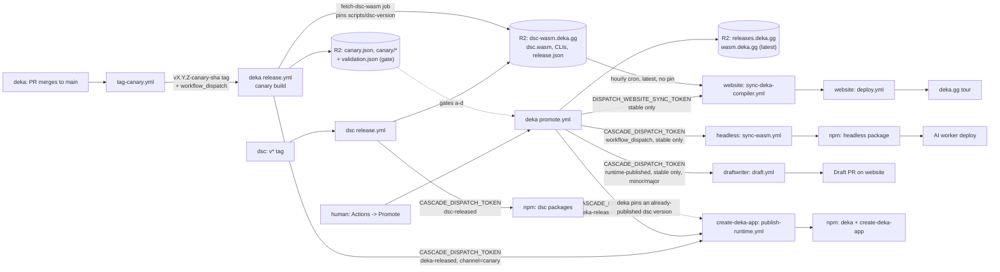

# Publishing the Deka runtime


This document describes how a new runtime release is produced, where the
artifacts land, and how downstream sites pick them up automatically.

## Overview

See [rfd#68](https://github.com/dekaruntime/rfd/issues/68) for the full design.
Every build is a **canary**; a **stable** release is a canary that a human
promotes, republishing the exact same bytes under the plain version. There is
exactly one compilation per version line.

- **canary** (`vX.Y.Z-canary-<sha>`): every merge to `main` gets one,
  automatically. `.github/workflows/tag-canary.yml` tags the merge commit and
  starts `.github/workflows/release.yml`, which builds the three CLI
  binaries + WASM, smoke-tests the built binary on each host, publishes to
  R2 under that canary's own path plus `canary.json` / `deka-wasm`'s
  `canary/*` pointers. Native runtime tests and relocated-app packaging gate
  publication; the publish job records their success in `validation.json`.
- **stable** (`vX.Y.Z`): created only by a human running
  **Actions → Promote → Run workflow** with the canary tag to promote.
  `.github/workflows/promote.yml` verifies the canary shipped, was validated
  green, and pins a stable dsc, then copies its bytes to the stable path,
  writes `latest.json` / `deka-wasm`'s `latest/*`, tags `vX.Y.Z` at the
  canary's commit, and notifies every downstream.

The old flow — a human pushing a `vX.Y.Z` tag straight into a full build —
no longer exists. `release.yml` builds canaries only; a plain `vX.Y.Z` ref
fails it fast with an error pointing at `promote.yml`.

Rust compilation uses sccache. Native validation runs on GitHub-hosted Linux
and macOS workers; legacy release jobs retain their existing runner setup.

## Cutting a release

1. Bump the workspace version and refresh `Cargo.lock`:
   ```bash
   ./scripts/bump-version.sh patch    # or minor, or an explicit X.Y.Z
   ```
2. Open a PR with the bump, merge it to `main`. **That's it** — merging is
   the only manual step to get a canary. `tag-canary.yml` tags the merge
   commit `vX.Y.Z-canary-<sha>` and starts `release.yml` for you.
3. Watch the canary build:
   ```bash
   gh run list --repo dekaruntime/deka --workflow=release.yml
   gh run watch <RUN_ID> --repo dekaruntime/deka --exit-status
   ```
4. Test the canary. It's a full, installable build at its own version —
   publication includes a `validation.json` gate result from successful runtime
   validation for the same commit, which `promote.yml` verifies.
5. Iterate if needed: a fix is another PR to `main`, which yields another
   canary of the same base version (`vX.Y.Z-canary-<new-sha>`) automatically.
   Only bump the version again for the *next* release line.
6. Promote when satisfied: **Actions → Promote → Run workflow**, enter the
   canary tag (e.g. `v0.59.0-canary-d5661ed`). See
   [Promotion, step by step](#promotion-step-by-step) below for exactly what
   this checks.

### Promotion, step by step

`promote.yml` enforces these gates, in order, all fail-closed:

1. **The input is a real, unpromoted canary.** It matches
   `vX.Y.Z-canary-<7-hex-sha>`, that tag exists in the repo, and no `vX.Y.Z`
   tag exists yet.
2. **The canary shipped.** `<canary>/release.json` exists on
   `releases.deka.gg` and its `commit` matches the canary tag's commit.
3. **Integration is green for this exact commit.** `<canary>/validation.json`
   exists, names the same commit, and its `gate` is `"green"`. A green
   result from a different (even newer) canary of the same version cannot be
   reused — the human pressing the button is what turns "tested" into
   "shipped", and it has to be *this* canary.
4. **Stable pins stable.** The canary's `dsc_version` must have no
   prerelease suffix (a stable deka cannot pin a canary dsc).

If every gate passes, `promote.yml` copies the canary's bytes to the stable
path in both R2 buckets (no rebuild), rewrites the manifest
(`version`/`tag`/`channel`/`promoted_from`, everything else — checksums,
commit and `dsc_version` unchanged), writes `latest.json` and
the WASM `latest/*` pointers, creates and pushes the `vX.Y.Z` tag at the
canary's commit, and notifies all five downstreams.

## Release artifacts

After a successful run the following are available on R2:

| Artifact | URL pattern | Consumers |
|---|---|---|
| Stable release manifest | `https://releases.deka.gg/latest.json` | CLI installers |
| Canary release manifest | `https://releases.deka.gg/canary.json` | Opt-in canary consumers (`install.sh --canary`) |
| Versioned release (stable) | `https://releases.deka.gg/<VERSION>/...` | Native CLI binaries, WASM files |
| Versioned release (canary) | `https://releases.deka.gg/<VERSION>-canary-<sha>/...` | Native CLI binaries, WASM files, plus `validation.json` (the promote gate result) |
| Stable compiler manifest | `https://wasm.deka.gg/latest/deka-compiler-artifact.json` | Website |
| Canary compiler manifest | `https://wasm.deka.gg/canary/deka-compiler-artifact.json` | Opt-in canary consumers |
| Diagnostics manifest | `https://wasm.deka.gg/latest/deka-diagnostics-artifact.json` | Website |
| Compiler WASM | `https://wasm.deka.gg/latest/deka_compiler.wasm` | Website tour |
| Diagnostics WASM | `https://wasm.deka.gg/latest/deka_diagnostics.wasm` | Website tour |

`latest.json` / `deka-wasm`'s `latest/*` move only in `promote.yml`, at the
end of a successful promotion. `canary.json` / `deka-wasm`'s `canary/*` move
at the end of every canary's `publish` job in `release.yml`, and are never
touched by promotion. Note the two R2 buckets disagree on whether a version
segment carries a `v` prefix: `deka-releases` paths have none (`/0.53.4/`,
`/0.59.0-canary-d5661ed/`); `deka-wasm` paths keep the `v` it always had
(`/v0.53.4/`, `/v0.59.0-canary-d5661ed/`).

## Downstream deployments

Neither `release.yml` nor `promote.yml` deploys anything directly — each ends
in a `notify` job (`needs: [publish]` / `needs: [promote]`, so nothing fires
until the run is green) that calls the shared
`.github/workflows/notify-downstream.yml` reusable workflow. The two channels
notify a different subset:

- **canary** (`release.yml`): `create-deka-app` (npm, `--tag canary`) only. Website tour, headless and draftwriter are
  stable-only — a canary never touches them.
- **stable** (`promote.yml`): website, npm, draftwriter and headless.

Each dispatch is independent — a failure in one does not undo the release,
but (see below) it can skip the ones that come after it in the same job.


```mermaid
flowchart LR
    dscTag[dsc: v* tag] --> dscRel[dsc release.yml]
    dscRel --> dscR2[("R2: dsc-wasm.deka.gg<br/>dsc.wasm, CLIs, release.json")]
    dscRel -->|CASCADE_DISPATCH_TOKEN<br/>dsc-released| npmDsc[npm: dsc packages]

    dekaMerge[deka: PR merges to main] --> dekaTagCanary[tag-canary.yml]
    dekaTagCanary -->|"vX.Y.Z-canary-sha tag<br/>+ workflow_dispatch"| dekaRel[deka release.yml<br/>canary build]
    dekaRel -->|fetch-dsc-wasm job<br/>pins scripts/dsc-version| dscR2
    dekaRel --> dekaR2canary[("R2: canary.json, canary/*<br/>+ validation.json (gate)")]
    dekaHuman[human: Actions -> Promote] --> dekaPromote[deka promote.yml]
    dekaR2canary -.->|gates a-d| dekaPromote
    dekaPromote --> dekaR2[("R2: releases.deka.gg<br/>wasm.deka.gg (latest)")]

    dekaPromote -->|DISPATCH_WEBSITE_SYNC_TOKEN<br/>stable only| webSync[website: sync-deka-compiler.yml]
    dscR2 -->|hourly cron, latest, no pin| webSync
    webSync --> webDeploy[website: deploy.yml] --> tour[deka.gg tour]


    dekaPromote -->|CASCADE_DISPATCH_TOKEN<br/>workflow_dispatch, stable only| headlessSync[headless: sync-wasm.yml]
    headlessSync --> headlessNpm[npm: headless package] --> aiWorker[AI worker deploy]

    dekaPromote -->|CASCADE_DISPATCH_TOKEN<br/>runtime-published, stable only, minor/major| draft[draftwriter: draft.yml]
    draft --> blogPr[Draft PR on website]

    dekaRel -->|CASCADE_DISPATCH_TOKEN<br/>deka-released, channel=canary| cda[create-deka-app: publish-runtime.yml]
    dekaPromote -->|CASCADE_DISPATCH_TOKEN<br/>deka-released, channel=stable| cda
    npmDsc -.->|deka pins an already-published dsc version| cda
    cda --> npmDeka[npm: deka + create-deka-app]
```

### Website (`dekaruntime/website`) — the tour

Stable-only: a canary never dispatches this (rfd#68). Triggered by:
- `workflow_dispatch` on `.github/workflows/sync-deka-compiler.yml`, sent by
  `promote.yml`'s `notify` job using `DISPATCH_WEBSITE_SYNC_TOKEN`.
- Independently, an hourly cron (`17 * * * *`) inside that same workflow.

What it does: `scripts/sync-deka-wasm-from-r2.ts` fetches
`https://dsc-wasm.deka.gg/latest/release.json` and the `dsc.wasm` /
`dsc_diagnostics.wasm` binaries **directly from dsc's own release bucket, not
from deka's `wasm.deka.gg` re-publish**. It commits them under `public/tour/`
only if the version or sha256 changed, then dispatches `deploy.yml` (pushed
with `GITHUB_TOKEN`, which cannot trigger a push-based deploy on its own, so
the sync workflow explicitly queues one).

Verified against the workflow, correcting an assumption in an earlier version
of this doc: **a dsc release updates the tour on its own**, via that hourly
cron, whether or not deka ever releases. A deka release's dispatch just makes
the sync happen sooner. deka's own `fetch-dsc-wasm` job — which downloads the
same dsc wasm at the version pinned in `scripts/dsc-version` and republishes
it to `wasm.deka.gg` for the legacy CLI-facing manifest — is a **separate
path that does not feed the tour**. The tour can therefore briefly be ahead of
what `wasm.deka.gg` (and deka's own pin) report, if dsc ships a version deka
has not picked up yet.

Silent on a missing token: if `DISPATCH_WEBSITE_SYNC_TOKEN` is unset, the
dispatch step logs and exits 0; the hourly cron is the safety net.

### Headless (`dekaruntime/headless`)

Stable-only (rfd#68). Triggered by: `workflow_dispatch` on
`.github/workflows/sync-wasm.yml`, sent by `promote.yml`'s `notify` job using
`CASCADE_DISPATCH_TOKEN` — note this calls the
`actions/workflows/.../dispatches` endpoint with just `ref: main`, not the
`repository_dispatch` (`runtime-released`) that workflow's own header comment
describes; that trigger currently has no sender. Falls back to headless's own
hourly cron (`17 * * * *`), which resolves "latest" from
`https://releases.deka.gg/latest.json` when no version is pinned.

What it does: pins deka's compiler wasm, runs headless's tests against it,
bumps and tags headless's own package version, and pushes — which fires
headless's `publish.yml` to publish an npm package carrying that deka
version, then deploys the AI worker. The workflow polls `gh run list` to
confirm `publish.yml` actually started and fails loudly if it did not.

Silent on a missing token: the dispatch step in `notify` exits 0 if
`CASCADE_DISPATCH_TOKEN` is unset; the hourly cron recovers within the hour.

### Release notes (`dekaruntime/draftwriter`)

Stable-only (rfd#68). Triggered by: `repository_dispatch` (`runtime-published`)
sent by `promote.yml`'s `notify` job using `CASCADE_DISPATCH_TOKEN`,
minor/major releases only — a patch tag exits the step immediately, since
release notes are written per minor.

What it does: calls `https://draftwriter.deka.gg/draft` (its own
`DRAFT_TOKEN`, not `CASCADE_DISPATCH_TOKEN`) to generate a draft, then opens a
PR on the website with it.

Silent on a missing dispatch token (exits 0 with a note to run `draft.yml`
manually) — but unlike the others, there is no cron fallback here, so a
dropped dispatch means someone has to notice and run it by hand.

### npm packages

Fires on both channels. See
[npm packages (downstream)](#npm-packages-downstream) below — that dispatch
(`deka-released` to `create-deka-app`) is sent by `release.yml`'s `notify` job
for every canary (`client_payload.channel: "canary"`, published under the npm
`canary` dist-tag) and again by `promote.yml`'s `notify` job on promotion
(`channel: "stable"`, npm `latest`).

## npm packages (downstream)

The runtime is also published to npm, but not by this repo. All npm delivery
lives in one public repo, `dekaruntime/create-deka-app`, with a single
workflow: `.github/workflows/publish-runtime.yml`. That repo never compiles
anything and never commits versions or binaries — the workflow downloads the
release binaries from `releases.deka.gg/<VERSION>/` (or, for a canary,
`releases.deka.gg/<VERSION>-canary-<sha>/`) and the matching `latest.json` /
`canary.json`, verifies every sha256 against the release manifest, stamps the
version into `package.json` files in the working tree only, and publishes via
npm trusted publishing (OIDC, no stored token). A canary version publishes
under the `canary` dist-tag (npm requires an explicit tag for any prerelease
version); a stable version publishes to `latest`.

### Packages

| Package | Role |
|---|---|
| `@dekaruntime/deka` | Launcher; ships both the `deka` and `dsc` commands |
| `@dekaruntime/deka-darwin-arm64` | Platform binary |
| `@dekaruntime/deka-darwin-x64` | Platform binary |
| `@dekaruntime/deka-linux-x64` | Platform binary |
| `create-deka-app` | `npx create-deka-app@latest myapp` scaffolder |

Windows is not yet supported (deka#1092).

### Lockstep with dsc

`@dekaruntime/deka@X` pins `@dekaruntime/dsc` at the exact version in
`scripts/dsc-version`, and the deka platform packages bundle the dsc binary at
that same pinned version. A deka release requires its pinned dsc version to
already be on npm — the workflow checks this before publishing anything and
fails closed otherwise. `create-deka-app@X` is published in the same run as
`@dekaruntime/deka@X` and pins it exactly. dsc keeps its own version line, so
a dsc release never changes what an existing deka/create-deka-app user
installs.

### Trigger

1. The "Trigger create-deka-app publish" step of the shared `notify` job
   (called from both `release.yml`, per canary, and `promote.yml`, per
   promotion) sends a `repository_dispatch` (`deka-released`,
   `client_payload: {tag, channel}`) to `dekaruntime/create-deka-app` using
   the org secret `CASCADE_DISPATCH_TOKEN`. `dekaruntime/deka` is in that
   secret's Repository access list.
2. Fallback: `create-deka-app` runs `publish-runtime.yml` hourly
   (`17 * * * *`); it publishes whatever the release hosts have that npm
   doesn't, for both the deka and dsc families (dsc first), and is a no-op
   otherwise.
3. Manual:
   `gh workflow run publish-runtime.yml -R dekaruntime/create-deka-app -f family=deka -f version=<X.Y.Z>`

### Guarantees

Every package in a run is pre-flighted (stamped version, no placeholder pins,
`npm pack` succeeds, binaries present in platform tarballs) before the first
`npm publish`, so one failure publishes nothing. Publish order is platform
packages → launcher → `create-deka-app`, each read back from the registry, so
users never see a half release. A run that dies partway is completed by the
next trigger — publishing an already-published version is treated as done.
A stable publish goes straight to the `latest` dist-tag; a canary publish
(a prerelease version) requires `--tag canary` at publish time, which is a
separate cross-repo change in `create-deka-app` tracked alongside rfd#68
(see "Needs Sami" in the rfd#68 PR if that work has not landed yet). Either
way the OIDC credential cannot run `npm dist-tag` after the fact.

### Verification

```bash
npm view @dekaruntime/deka dist-tags.latest
npm view create-deka-app dist-tags.latest
```

Both should equal the released version within ~10 minutes of the release job
finishing.

```bash
gh run list -R dekaruntime/create-deka-app --workflow publish-runtime.yml
```

## Required secrets

Secrets live in `dekaruntime/deka` unless noted otherwise.

| Secret | Used by | Required permissions |
|---|---|---|
| `R2_ACCESS_KEY_ID` | `release.yml`, `promote.yml` | Read/write on the R2 buckets below |
| `R2_SECRET_ACCESS_KEY` | `release.yml`, `promote.yml` | Read/write on the R2 buckets below |
| `DISPATCH_WEBSITE_SYNC_TOKEN` | `promote.yml` (`notify` job) | `actions:write` on `dekaruntime/website`, to dispatch `sync-deka-compiler.yml` |
| `CASCADE_DISPATCH_TOKEN` | `release.yml` and `promote.yml` (`notify` job in both) | Org secret; `dekaruntime/deka` must be in its Repository access list. Dispatches the npm publish (`create-deka-app`) from both channels; the headless sync and the release-note draft (`draftwriter`) from `promote.yml` only |

`tag-canary.yml` uses only the built-in `GITHUB_TOKEN` (to push the canary
tag and to `gh workflow run release.yml`) — no new secret. `promote.yml`
also uses only `GITHUB_TOKEN` to push the stable tag, plus the R2 and
`CASCADE_DISPATCH_TOKEN`/`DISPATCH_WEBSITE_SYNC_TOKEN` secrets above, all of
which already exist in this repo.

`CASCADE_DISPATCH_TOKEN` is an organization secret shared with `dekaruntime/dsc`
and the other repos in this cascade; it is not set per-repo. Missing it
degrades most of `notify`'s steps to their own hourly-polling fallback,
except the npm dispatch, which fails the job outright.

Downstream repos also need their own `CLOUDFLARE_API_TOKEN` /
`CLOUDFLARE_ACCOUNT_ID` (website) and `DRAFT_TOKEN`
(draftwriter), but those are unrelated to the runtime release and live in
those repos.

## Manual fallback

If a downstream dispatch ever fails, things can be re-triggered manually:

```bash
# Website tour
gh workflow run sync-deka-compiler.yml --repo dekaruntime/website --ref main


# Headless (pins to the latest deka release unless -f version=X.Y.Z is given)
gh workflow run sync-wasm.yml --repo dekaruntime/headless --ref main

# Release-note draft (minor/major releases only; -f tag is required)
gh workflow run draft.yml --repo dekaruntime/draftwriter --ref main -f tag=vX.Y.Z

# npm packages -- see "npm packages (downstream)" above
```

The website sync and headless sync also run on an hourly schedule as a
backup, as does create-deka-app's npm publish. Testsuite-site and draftwriter
have no schedule — a dropped dispatch to either needs a manual run.

## Verification

After a release, confirm each downstream actually moved:

```bash
# R2 manifests deka's own release job wrote
curl -s https://releases.deka.gg/latest.json | jq -r .version
curl -s https://wasm.deka.gg/latest/deka-compiler-artifact.json | jq -r '.compiler.version'

# The live tour (sourced from dsc-wasm.deka.gg, not wasm.deka.gg -- see
# "Downstream deployments" above)
curl -s https://deka.gg/tour/deka-compiler-artifact.json | jq -r '.compiler.version'

# npm packages (see "npm packages (downstream)" above for the full list)
npm view @dekaruntime/deka dist-tags.latest
npm view @dekaruntime/dsc dist-tags.latest
npm view create-deka-app dist-tags.latest
```

The R2 manifests should match the tag you just pushed immediately; the tour
and npm views should match within minutes to an hour, depending on whether
the dispatch fired or a repo fell back to its own polling.

To see whether the dispatches actually fired, rather than assuming from a
downstream symptom, read the `notify` job's own log:

```bash
gh run list --repo dekaruntime/deka --workflow=release.yml --limit 1
gh run view <RUN_ID> --repo dekaruntime/deka --log --job=notify
```

## Troubleshooting

### Downstream dispatch returns 403, or `notify` fails outright

`DISPATCH_WEBSITE_SYNC_TOKEN` only guards the website step, and its absence
is silent (exit 0) — a 403 there means the PAT is under-scoped, not missing.
`CASCADE_DISPATCH_TOKEN` is the one to check for everything else: it is an
org secret, so a 403 usually means `dekaruntime/deka` was dropped from (or
never added to) its Repository access list, not that the token itself is
wrong. Re-scope/re-add it with `actions:write` on `dekaruntime/website`, and
repository access to `dekaruntime/create-deka-app`,
`dekaruntime/headless`, and
`dekaruntime/draftwriter`.

### npm did not update after a release

1. Read the `notify` job log (see Verification) for the "Trigger npm package
   publish" step — did it run and return success?
2. Check `gh run list -R dekaruntime/create-deka-app --workflow publish-runtime.yml`
   for a run against the released tag.
3. If neither ran, `create-deka-app`'s hourly fallback (`17 * * * *`) picks up
   the release within the hour on its own.
4. To force it:
   `gh workflow run publish-runtime.yml -R dekaruntime/create-deka-app -f family=<deka|dsc> -f version=<X.Y.Z>`

### One downstream dispatch failing can skip the ones after it

The `notify` job runs website, npm, release-note draft and headless dispatches in
that order. A failed step skips later steps by default. Check the job log before
assuming that every downstream received a successful notification.

### Website sync commits WASM but does not deploy

The sync workflow dispatches the deploy job with `curl` and `GITHUB_TOKEN`. If
it previously failed with exit code 127, the runner was missing the `gh` CLI.
The workflow now uses `curl` directly, but the `actions:write` permission must
still be granted to `GITHUB_TOKEN`.


The external corpus and testsuite-site release cascade are retired. The native
frontend is local; remaining legacy DSC consumers must migrate before that
repository can be archived. See [VERSIONING.md](VERSIONING.md).
