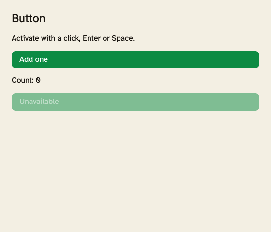
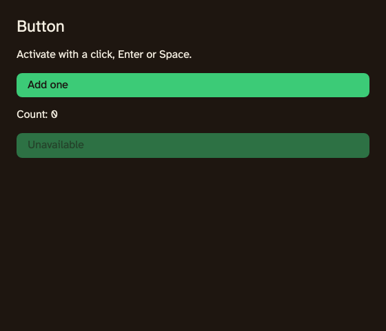
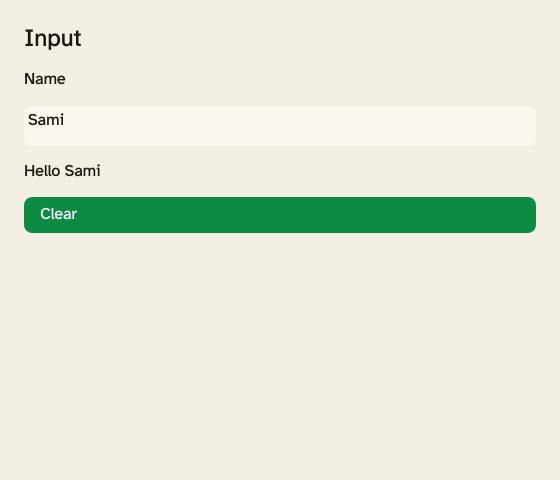
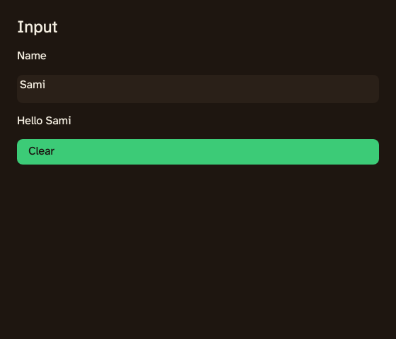
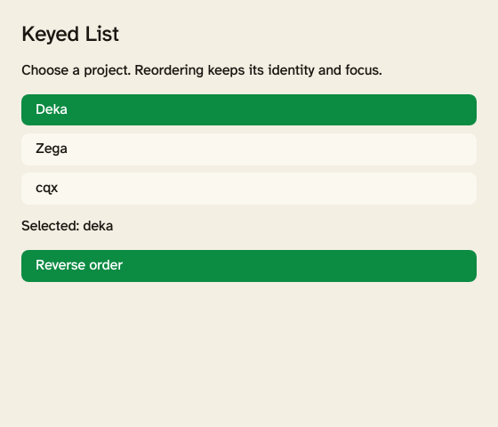
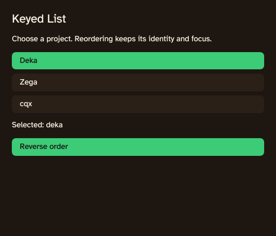
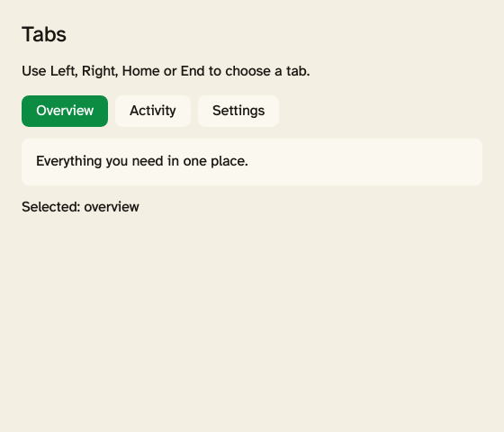
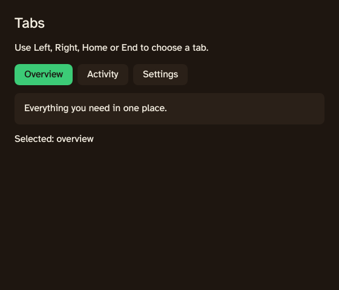

# Components

The first Rust UI set includes `Button`, `Input`, keyed `List`, and horizontal
`Tabs`. Import them from `deka_ui::components`; author them with `view!` and
`#[component]`, alongside ordinary views and signals.

```rust
use deka_ui::{components::{Button, Input, Theme}, prelude::*};
use std::rc::Rc;

#[component]
fn App() -> View {
    let name = signal("Sami".to_owned());
    let theme = signal(Theme::Light);
    view! { <view class="p-4 gap-3">
        <Input label="Name" value={name} theme={theme}/>
        <Button label="Clear" theme={theme}
            on_press={Rc::new(move || name.set(String::new()))}/>
        <p>"Hello {name}"</p>
    </view> }
}
```

Typing `Ava` changes the paragraph to `Hello Ava`. Activating Clear changes the
signal and editor to the empty string. Components run once; bound properties
react to signals without re-running their constructors.

## Theme and motion

Pass the same `Signal<Theme>` to each component. `theme.set(Theme::Dark)` patches
already mounted controls. Defaults use light. `Theme::tokens()` exposes semantic
background, surface, foreground, muted, accent and accent-foreground colours;
`page_class()` and `surface_class()` apply them to ordinary views. The palette
matches zega.dev's warm surfaces and green accents.

`MotionPreset::Enter`, `Exit`, and `Press` expose native utility classes. Apply
Enter/Exit to a conditional view; the renderer owns its presence and inert exit
presentation. Buttons play the finite Press timeline on each activation. Motion
is rendered through the existing shared animator; use the host's reduced-motion
preference (or explicit `LaunchOptions.reduced_motion`) to snap to the settled
presentation. Browser mounts respect `prefers-reduced-motion`. Motion never delays
signal updates or actions.

## Button and Input

Button requires a visible `label` and `Rc<dyn Fn()>` `on_press` callback. Input
requires a `label` and `Signal<String>` `value`. Both accept optional `id`, a
shared `theme`, and a `Signal<bool>` `disabled`. Input also accepts a placeholder.
Labels are exposed through the retained accessibility tree. Disabled controls
are skipped by keyboard focus and platform actions.

Input uses the existing single-line host editor: pointer focus and selection,
Shift-selection, IME composition, undo/redo, and platform copy/cut/paste shortcuts.
The native window uses its platform clipboard; the browser uses its native text
field. Clipboard failures use the app error sink. A missing platform clipboard
is reported rather than replaced with an unrelated service.

## Keyed List

```rust
use deka_ui::{components::{List, ListItem}, prelude::*};

#[component]
fn Projects() -> View {
    let items = signal(vec![ListItem::new("deka", "Deka"), ListItem::new("zega", "Zega")]);
    let selected = signal(None);
    view! { <List label="Projects" items={items} selected={selected}/> }
}
```

Clicking Zega or activating its focused row sets `selected` to `Some("zega")`.
`items.update(|items| items.reverse())` changes order while keeping each keyed
node, event handler and focus identity. Update labels or `ListItem.disabled`
through the items signal. Rows have `listitem` semantics inside a labelled list;
Tab follows their current order and skips disabled rows. This is a selectable
list of buttons, with ordinary Tab and Enter/Space navigation.

For custom stateful rows, use `View::keyed(keys, row)`. `keys` reads the collection
signal and returns unique string keys. `row(key)` constructs a view only when a
key first appears; use signal bindings inside the row for changing data. Reorder
keeps row-local state and effective writes. Removing a key disposes its signals,
bindings and handlers. Re-adding it creates a fresh row. Duplicate keys report an
app error and preserve the last valid mounted collection.

## Tabs

Tabs takes a unique, nonempty `id`, an accessible `label`, a `Vec<TabItem>` and a
`Signal<String>` `selected` key. `TabItem::new(key, label, panel)` accepts a
reusable panel factory. Set `TabItem.disabled` before mounting to skip an option.
Keys must be unique and nonempty. The set of tabs is fixed for that mount.

```rust
use deka_ui::{components::{TabItem, Tabs}, prelude::*};

#[component]
fn Workspace() -> View {
    let selected = signal("overview".to_owned());
    let items = vec![
        TabItem::new("overview", "Overview", || view! { <p>"Project overview"</p> }),
        TabItem::new("activity", "Activity", || view! { <p>"Recent activity"</p> }),
    ];
    view! { <Tabs id="workspace" label="Workspace" items={items} selected={selected}/> }
}
```

Left/Right wrap between enabled tabs; Home/End choose the first/last enabled
tab. Selection follows focus. Tab/Shift-Tab leave or enter the tab strip at its
selected tab. Pointer activation also updates selection. Unknown or disabled
selected keys display the first enabled tab; an all-disabled or empty set has
no active panel. `tablist`, `tab`, selected state, panel labels and control
relationships are exposed to native AccessKit and the browser accessibility tree.

Only the selected panel's contents are mounted. Switching panels disposes local
state; keep persistent panel state in parent signals. A retained element's
`focus()` requests focus in its originating host, which validates current
focusability and hidden/disabled ancestry.

## Showcase

The four examples live at `crates/deka_ui/examples/showcase/`. They supply the
compiled tour's source manifest, renderer histories and themed constructors.
The existing 27 DekaScript parity lessons retain their unchanged reference gate.
Call the tour's `start` with `component-button-light`, `component-input-dark`,
`component-list-light` or `component-tabs-dark` (both themes exist for each).
The package includes their repository source alongside the compiled preview.

Offscreen screenshots use the production native GPU renderer:

| Component | Light | Dark |
| --- | --- | --- |
| Button |  |  |
| Input |  |  |
| List |  |  |
| Tabs |  |  |

Badge, Toast, modal Dialog and Menu remain the next component slice.
